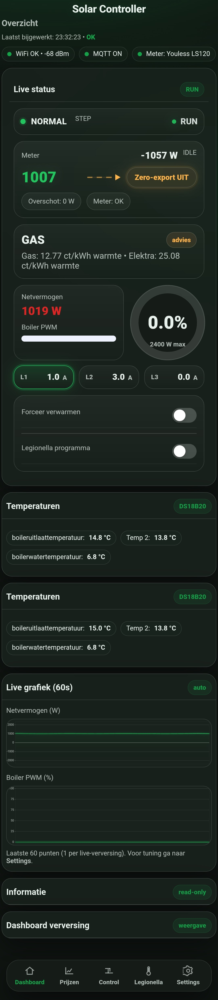
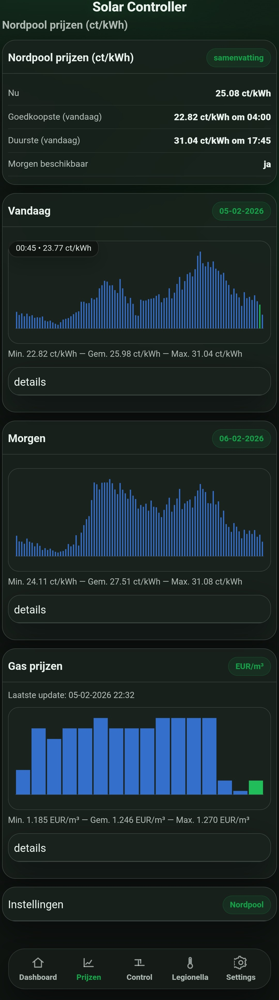
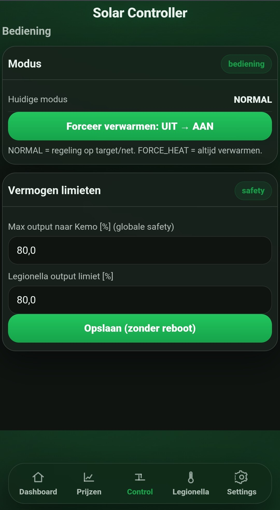
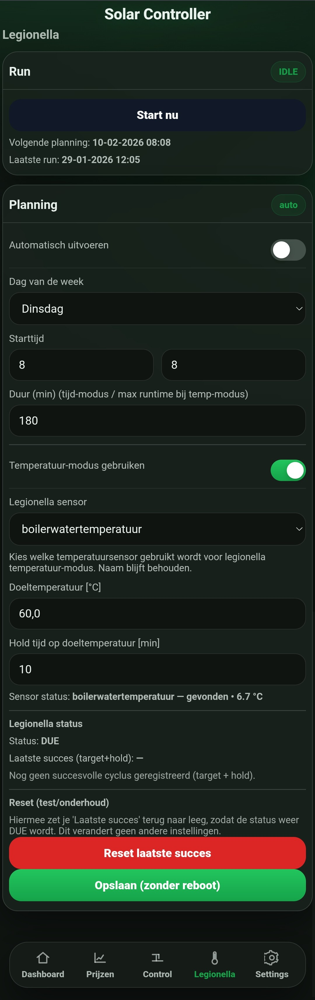
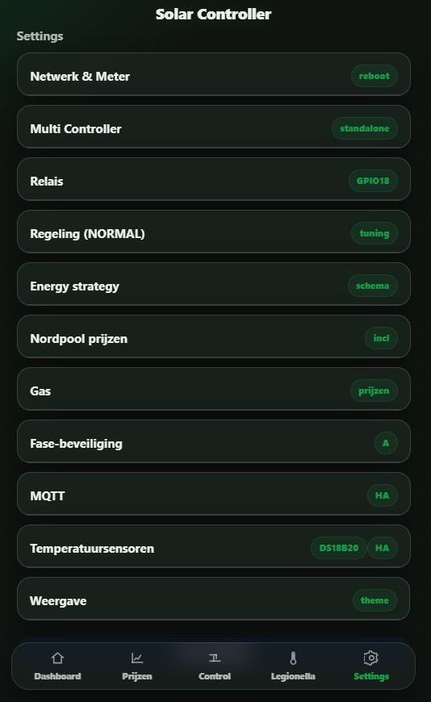

# ☀️ Solar Controller (ESP32)

**Solar Controller** is een ESP32-gebaseerde controller voor het **slim en volledig lokaal benutten van zonne-overschot**.  
De controller stuurt verbruikers (zoals een elektrische boiler) **traploos** aan op basis van **actueel vermogen**, **energieprijzen** en **instellingen** — zonder cloudafhankelijkheid.

---

## 🎯 Doelstellingen
- Maximaal eigen verbruik  
- Minimale (of nul) teruglevering  
- Slim inspelen op dynamische energieprijzen  
- Volledig automatisch, maar transparant en instelbaar  
- Geschikt voor dagelijks en langdurig gebruik  

---

## 🔧 Wat doet de Solar Controller?

- Leest realtime **P1-meterdata** (import / export)
- Detecteert zonne-overschot en netafname
- Stuurt verbruikers **traploos via PWM**
- Combineert zonne-overschot met **Nordpool dynamische energieprijzen**
- Kan automatisch kiezen tussen:
  - zonne-overschot benutten
  - elektrisch verwarmen bij goedkope stroom
- Beschikt over een **volledig ingebouwde webinterface**
- Ondersteunt **OTA firmware-updates via GitHub**

---

## ✨ Kernfunctionaliteit

### ⚡ Slim energiegebruik
- Continue vermogensregeling (geen relais-achtig aan/uit gedrag)
- Reageert direct op:
  - zonne-productie
  - huishoudelijk verbruik
  - netimport / netexport

**Geschikt voor:**
- Elektrische boilers  
- Verwarmingselementen  
- Andere resistieve belastingen  

---

### 🔥 Gas versus Elektrisch verwarmen (nieuw)

De Solar Controller kan nu **automatisch bepalen of gas of elektriciteit goedkoper is** en hierop handelen.

**Functionaliteit**
- Vergelijkt actuele gas- en elektriciteitsprijzen
- Houdt rekening met:
  - rendement
  - energiebelasting
  - inkoopkosten
  - BTW
- Geeft continu een **advies**:
  - *Gas verwarmen*
  - *Elektrisch verwarmen*

**Automatisch uitvoeren**
- Optioneel kan het advies **Elektrisch verwarmen automatisch worden uitgevoerd**
- Wanneer elektriciteit goedkoper is dan gas:
  - kan de boiler actief elektrisch worden opgewarmd
  - ook **zonder zonne-overschot**
- Ideaal voor:
  - winterperiodes
  - goedkope dynamische stroomprijzen

**Prioriteit**
- Automatisch elektrisch verwarmen heeft **dezelfde prioriteit** als:
  - Forceer verwarmen
  - Legionella-modus
- Wordt niet geblokkeerd door tijdschema’s of normale beperkingen
- Zonne-overschot blijft altijd leidend wanneer beschikbaar

---

### 🌡️ Temperatuursensoren (DS18B20)

Ondersteuning voor **meerdere temperatuursensoren** via 1-Wire.

**Eigenschappen**
- Meerdere DS18B20-sensoren op één datapin
- Automatische detectie
- Per sensor instelbaar:
  - Naam
  - Actief / inactief
- Eén sensor kan worden aangewezen als **CONTROL-sensor**
  - gebruikt voor regeling en legionella-logica

**Integratie**
- Temperatuur zichtbaar in:
  - Solar Controller dashboard
  - Home Assistant (via MQTT Discovery)
- Sensor-namen worden automatisch overgenomen in Home Assistant

---

### 📊 Dynamische energieprijzen (Nordpool)

Volledige integratie van **Nordpool spotprijzen**.

**Ondersteund**
- Prijzen voor vandaag en morgen
- Positieve én negatieve prijzen
- Gebruik in regelstrategie:
  - goedkoopste uren
  - negatieve uren
  - combinatie van prijs + zonne-overschot

Hiermee wordt energieverbruik automatisch verschoven naar de economisch meest gunstige momenten.

---

### ⚡ P1-meter compatibiliteit (bewezen)

Geteste en gebruikte P1-meters:

#### ✔️ Youless LS120
- Actueel vermogen (import / export)
- Zeer stabiel
- Veel gebruikt in combinatie met de Solar Controller

#### ✔️ HomeWizard P1 Meter
- Realtime vermogensdata
- Direct inzetbaar

#### ✔️ Smart Gateways P1
- Actueel vermogen (import / export)
- Fasewaardes beschikbaar
- Ondersteuning toegevoegd in de Solar Controller

**Gebruik**
- Detectie van zonne-overschot
- Minimaliseren van teruglevering
- Nauwkeurige vermogensregeling
- Fase-informatie voor fasebeveiliging
  
---

## 🛡️ Fasebewaking (veiligheidsfunctie)

De Solar Controller beschikt over een **optionele fasebewaking** die helpt om het energiegebruik **veilig over de netfases te verdelen**.

**Werking**
- Controleert continu of de belasting per fase binnen veilige grenzen blijft
- Reageert direct op afwijkende of onbetrouwbare meetsituaties
- Voorkomt ongewenste belasting van één enkele fase

**Belangrijk**
- Fasebewaking is **instelbaar** en alleen actief wanneer deze functie is ingeschakeld
- Werkt correct met:
  - Youless LS120
  - HomeWizard P1 Meter
- Bij ontbrekende of onbetrouwbare fase-informatie grijpt de beveiliging automatisch in

**Doel**
- Extra bescherming van installatie en netaansluiting
- Meer stabiliteit bij hogere vermogens
- Veiliger langdurig en autonoom gebruik

---

## 🌐 Webinterface (standalone)

De Solar Controller bevat een **volledig geïntegreerde webinterface**.

**Functionaliteit**
- Dashboard met:
  - actuele status
  - vermogensregeling
  - temperaturen
  - gas vs elektrisch advies
- Instellingenpagina
- Firmware / OTA-updatepagina

**Toegang**
- PC
- Tablet
- Smartphone  

Geen externe software of cloud nodig.

---

## 🔌 API & integraties

### 🌐 HTTP API (REST)
Lokale HTTP-API voor:
- Webinterface
- Statusinformatie
- Configuratie
- Firmware-updates

Ontworpen voor stabiliteit en lage geheugenbelasting.

---

### 🔁 MQTT

MQTT is een **kernonderdeel** van het systeem.

**Ontvangen**
- Actueel vermogen
- Nordpool prijsinformatie

**Publiceren**
- Status
- Actieve modus
- PWM-vermogen
- Temperaturen
- Verwarmingsadvies

Geschikt voor:
- Home Assistant
- Node-RED
- Logging en monitoring

---

### 🏠 Home Assistant integratie

Naadloze integratie met **Home Assistant**.

**Kenmerken**
- MQTT Discovery
- Automatische entity-aanmaak
- Sensor-namen worden overgenomen
- Home Assistant kan visualiseren en automatiseren  
- De Solar Controller blijft **autonoom beslissen**

---

## 🔄 Firmware & OTA updates

**Ondersteund**
- OTA updates via GitHub
- Handmatige update via webinterface
- Automatische update (instelbaar)
- Volledige voortgangsindicatie
- Automatische reboot

**Update-controle**
- Bij opstarten
- Periodiek (interval-gestuurd)

---

## 🧠 Ontwerpfilosofie

- Geen cloudafhankelijkheid
- Alles lokaal
- Transparant gedrag
- Geen black-box logica
- Ontworpen voor:
  - stabiliteit
  - langdurig gebruik
  - uitbreidbaarheid

---

## 📜 Disclaimer

Dit project is bedoeld voor **educatief en eigen gebruik**.  
Gebruik is volledig op eigen risico. De auteur is niet aansprakelijk voor schade door foutieve installatie of gebruik.

---

## ❤️ Motivatie

De Solar Controller is ontstaan uit de wens om:
- Slimmer met energie om te gaan
- Onafhankelijk te zijn van cloud-diensten
- Zonne-energie **écht optimaal** te benutten

## 📘 Documentatie

- 👉 [Benodigde hardware](docs/hardware.md)
- 👉 [Installatiehandleiding](docs/installatie.md)
- 👉 [Configuratie & instellingen](docs/configuratie.md)
- 👉 [OTA of USB installatie & update](docs/OTA_OF_USB_UPDATE.md)

---

  
  
  

  
  

